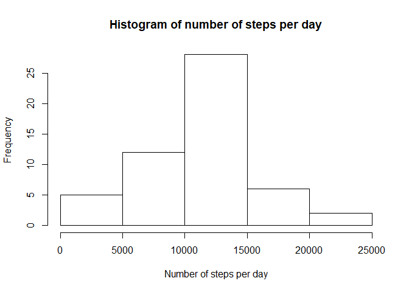
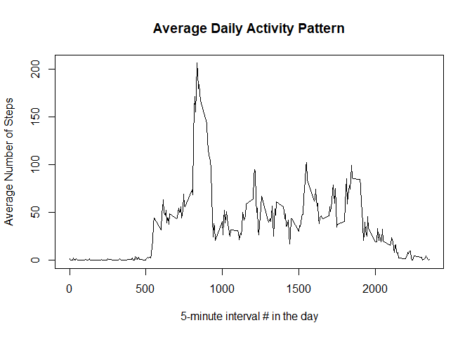
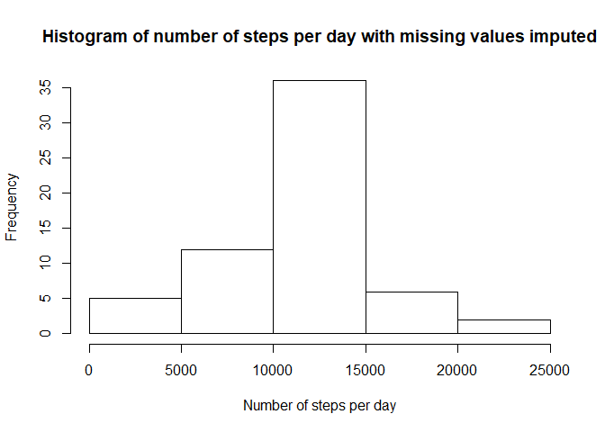
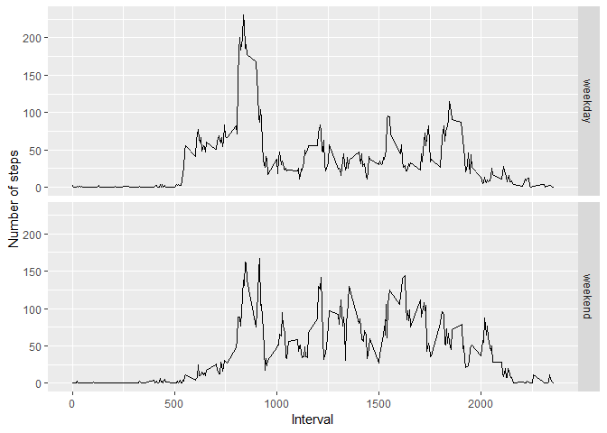

##Loading and preprocessing the data

```r
activity <- read.csv("activity.csv")
library(data.table)
library(ggplot2)
```

##What is mean total number of steps taken per day?

```r
steps_by_date <- aggregate(steps~date, activity, sum)
hist(steps_by_date$steps, main = "Histogram of number of steps per day", xlab = "Number of steps per day")
```

<!-- -->

```r
mean_steps <- mean(steps_by_date$steps)
median_steps <- median(steps_by_date$steps)
cat("The mean and median of total number of steps taken per day are",  mean_steps,"and",median_steps,"respectively.")
```

```
## The mean and median of total number of steps taken per day are 10766.19 and 10765 respectively.
```

##What is the average daily activity pattern?

```r
steps_per_interval <- aggregate(steps~interval, activity, mean)
plot(steps_per_interval$interval, steps_per_interval$steps, type = "l", xlab = "5-minute interval # in the day", ylab = "Average Number of Steps", main="Average Daily Activity Pattern")
```

<!-- -->

```r
max_steps_interval <- steps_per_interval[which.max(steps_per_interval$steps),]$interval
cat("The 5-minute interval that contains the maximum number of steps on average is", max_steps_interval)
```

```
## The 5-minute interval that contains the maximum number of steps on average is 835
```

##Imputing missing values (with mean for that interval)

```r
cat("Total number of records with NA is", sum(is.na(activity$steps)))
```

```
## Total number of records with NA is 2304
```

```r
setDT(activity)
impute.mean <- function(x) replace(x, is.na(x), mean(x, na.rm = TRUE))
activity_imputed <- activity[, steps := as.integer(impute.mean(steps)), by = interval]

#Histogram and Mean, Median with imputed dataset
steps_by_date_imputed <- aggregate(steps~date, activity_imputed, sum)
hist(steps_by_date_imputed$steps, main = "Histogram of number of steps per day with missing values imputed", xlab = "Number of steps per day")
```

<!-- -->

```r
mean_steps_imputed <- mean(steps_by_date_imputed$steps)
median_steps_imputed <- median(steps_by_date_imputed$steps)
cat("The mean and median of total number of steps taken per day are",  mean_steps_imputed,"and",median_steps_imputed,"respectively.")
```

```
## The mean and median of total number of steps taken per day are 10749.77 and 10641 respectively.
```

##Are there differences in activity patterns between weekdays and weekends?

```r
activity_imputed$dayofweek <- weekdays(as.Date(activity_imputed$date))

activity_imputed$daytype <- ifelse(activity_imputed$dayofweek == "Saturday" | activity_imputed$dayofweek == "Sunday", "weekend", "weekday")

steps_per_interval_weekday <- aggregate(steps~interval + daytype, activity_imputed, mean)

qplot(interval, steps, data = steps_per_interval_weekday, geom = c("line"), xlab = "Interval", ylab = "Number of steps") + facet_grid(daytype ~ .)
```

<!-- -->
